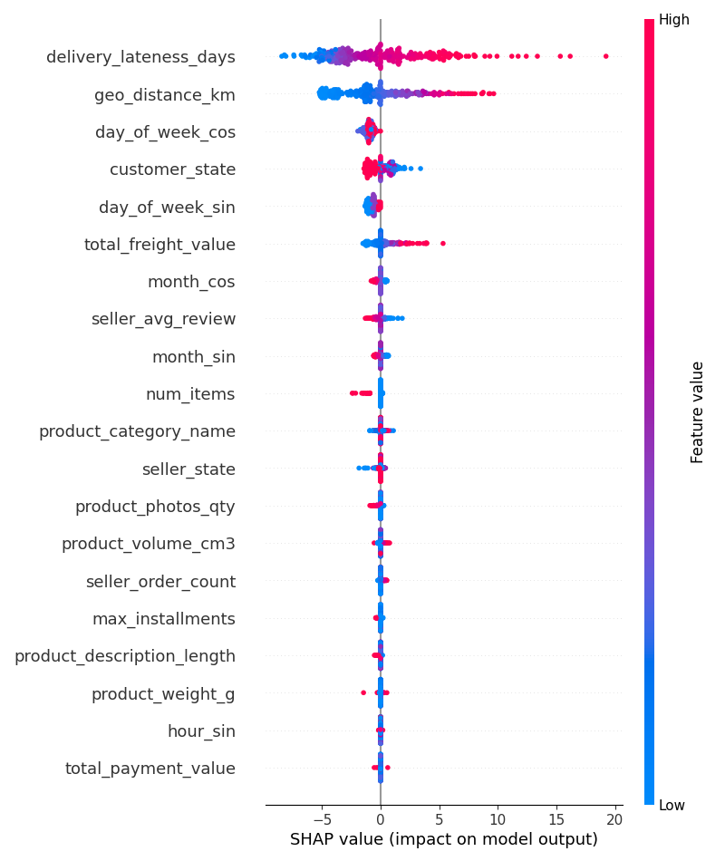
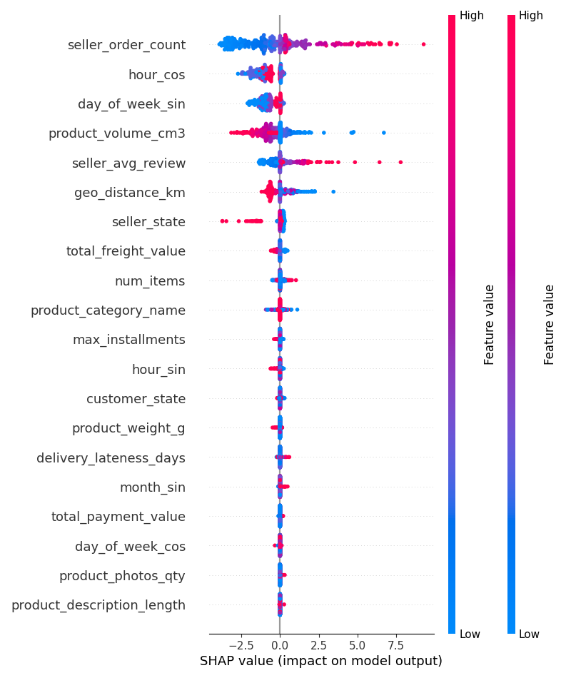

<div align="center">
  
# 📦 Olist Multi-Task Learning (MTL) Pipeline

**A Full-Stack Data Product for E-commerce Logistics and Customer Satisfaction**

[](https://www.python.org/downloads/release/python-3120/)
[](https://github.com/astral-sh/uv)
[](https://duckdb.org/)
[](https://pytorch.org/)
[](https://fastapi.tiangolo.com/)

</div>

---

## 🎯 The End Goal and The "Why"

### 🏢 The Business Objective

In e-commerce, **logistics and customer satisfaction are intrinsically linked**. A delayed shipment almost guarantees a negative review, regardless of product quality.

The goal of this project is to build a system that simultaneously predicts two critical outcomes for a delivered order:

1. **Delivery Time (Regression)**: How many days the package should have taken to arrive?
2. **Customer Satisfaction (Classification)**: Will the customer leave a positive review (score >= 4), or a negative one?

### 🧠 The Architectural "Why"

Standard models fail here. Treating these as two completely separate models ignores the heavy correlation between shipping delays and angry customers. Conversely, a rigid Shared-bottom model suffers from **negative transfer** because predicting numerical "days" and predicting human "sentiment" require fundamentally different mathematical representations.

**The Solution:** We are building a **Multi-gate Mixture-of-Experts (MMoE)**. This allows the neural network to share broad latent features (like geographic distance or freight cost) while utilizing independent gates to protect the task-specific heads from cross-contamination.

### ⚙️ The Engineering "Why"

A Jupyter notebook cannot run in production. This project demonstrates the jump from academic data science to a **Lead Machine Learning Engineer** role by integrating serverless SQL, strict data validation, version control, and high-performance serving to handle the entire lifecycle of enterprise data.

---

## 🛠 The Tech Stack

| Layer                          | Tool                                                   | Status     |
| ------------------------------ | ------------------------------------------------------ | ---------- |
| **Environment & Dependencies** | `uv` _(Rust-based, reproducible virtual environments)_ | ✅ Active  |
| **Data Engineering (ETL)**     | `DuckDB` _(Serverless analytical SQL)_                 | ✅ Active  |
| **Data Contracts**             | `Pydantic` _(Strict schema validation)_                | ✅ Active  |
| **Statistical Research**       | `scipy.stats` _(Hypothesis testing)_                   | ✅ Active  |
| **Visualization**              | `matplotlib` + `seaborn` _(Custom Plotter library)_    | ✅ Active  |
| **Data Versioning**            | `DVC` _(Git for massive datasets)_                     | ✅ Active  |
| **Deep Learning**              | `PyTorch` _(Custom MMoE architecture)_                 | ✅ Active  |
| **Experiment Tracking**        | `MLflow` _(Hyperparameters & loss curves)_             | ✅ Active  |
| **Model Export**               | `ONNX Runtime` _(Optimized inference)_                 | 🔲 Planned |
| **Serving**                    | `FastAPI` _(REST API)_                                 | 🔲 Planned |
| **CI/CD & UI**                 | `GitHub Actions`, `Docker`, `Streamlit`                | 🔲 Planned |

---

## 📂 Project Structure

```
Olist_MTL_Pipeline/
├── main.py                           # Pipeline entry point
├── pyproject.toml                    # uv project config & dependencies
├── uv.lock                           # Reproducible dependency lock
│
├── data/                             # ⚠️ Entire folder is gitignored
│   ├── raw/                          # 9 raw Olist CSV files
│   ├── olist.duckdb                  # Built DuckDB data warehouse
│   ├── splits/
│   │   ├── df_model.parquet          # Full modelling-ready dataset
│   │   ├── train.parquet             # Training split
│   │   ├── val.parquet               # Validation split
│   │   └── test.parquet              # Test split
│   └── preprocessed/                 # Preprocessed data (NumPy arrays)
│       ├── train_features.npy        # Training split features
│       ├── val_features.npy          # Validation split features
│       ├── test_features.npy         # Test split features
│       ├── train_review_score.npy    # Training split review score targets (binary)
│       ├── val_review_score.npy      # Validation split review score targets
│       ├── test_review_score.npy     # Test split review score targets
│       ├── train_delivery_days.npy   # Training split delivery days targets (z-scored)
│       ├── val_delivery_days.npy     # Validation split delivery days targets
│       ├── test_delivery_days.npy    # Test split delivery days targets
│       └── delivery_scaler.pkl       # StandardScaler fitted on train delivery targets
│
├── sql/
│   └── build_db.sql                  # DuckDB warehouse DDL & analytical view
│
├── src/
│   ├── etl.py                        # ETL orchestrator + data validation
│   ├── schemas.py                    # Pydantic data contracts
│   ├── models/
│   │   ├── dataset.py                # Dataset class for PyTorch (with NaN handling)
│   │   ├── MTLLoss.py                # Learned uncertainty-weighted multi-task loss
│   │   ├── train.py                  # Training + evaluation + MLflow logging
│   │   ├── mmoe.py                   # MMoE model class
│   │   ├── sanity_check.py           # Isolated single-task MLP baseline tests
│   │   └── SHAP.py                   # SHAP explainability for both task heads
│   └── features/
│       ├── haversine.py              # Haversine distance feature
│       ├── cyclic.py                 # Cyclic features
│       ├── pipeline.py               # Feature pipeline
│       ├── build_features.py         # Feature builder
│       └── splits.py                 # Split data into train, val, test
│
├── reports/                          # Per-run CSVs + SHAP summary plots
│
└── EDA/
    ├── plots.py                      # Reusable Pydantic-configured plotting library
    └── 01_hypothesis_testing.ipynb   # Statistical hypothesis testing notebook
```

---

## ✅ Work Completed

### Phase 0 — Data Engineering (ETL) ✅

#### 1. Raw Data Ingestion

All **9 raw Olist CSV files** are ingested into DuckDB tables via `sql/build_db.sql`:

| Table         | Source File                        |
| ------------- | ---------------------------------- |
| `customers`   | `olist_customers_dataset.csv`      |
| `orders`      | `olist_orders_dataset.csv`         |
| `reviews`     | `olist_order_reviews_dataset.csv`  |
| `items`       | `olist_order_items_dataset.csv`    |
| `products`    | `olist_products_dataset.csv`       |
| `sellers`     | `olist_sellers_dataset.csv`        |
| `payments`    | `olist_order_payments_dataset.csv` |
| `geolocation` | `olist_geolocation_dataset.csv`    |

#### 2. Analytical Base Table (SQL View)

A single `analytical_base_table` view is built via **5 CTEs** that handle the one-to-many and duplicate-resolution problems in the raw data:

- **`aggregated_payments`** — Sums `payment_value` and takes `MAX(installments)` per order (handles multiple payment methods).
- **`distinct_geo`** — Averages duplicate lat/lng entries per zip code prefix.
- **`aggregated_items`** — Sums price and freight per order, resolves to a single seller/product.
- **`seller_stats`** — Computes historical order count per seller.
- **`seller_reviews`** — Computes historical average review score per seller.

The final `SELECT` joins all 8 tables, computes `delivery_days` (date diff between purchase and delivery) and `delivery_lateness_days` (date diff between estimated and actual delivery), and filters to **delivered orders only**.

#### 3. Pydantic Data Contracts (`src/schemas.py`)

Every row of the analytical base table is validated against a strict `OlistAnalyticalRow` Pydantic model that enforces:

- **Type safety** — `datetime`, `str`, `float`, `int` types on all fields.
- **Business rules** — `review_score ∈ [1, 5]`, `price ≥ 0`, `freight_value ≥ 0`, `customer_state` is exactly 2 characters, etc.
- **NaN handling** — A custom `@field_validator` converts `float('nan')` → `None` across all optional fields, preventing silent data corruption.

The ETL pipeline (`src/etl.py`) runs every row through this contract and logs any schema violations via `loguru` before failing or passing the pipeline.

#### 4. Data Splits

The modelling-ready dataset has been split into **train / validation / test** Parquet files stored in `data/splits/`.

---

### Phase 1 — EDA & Hypothesis Testing ✅

#### Reusable Plotting Library (`EDA/plots.py`)

A production-grade plotting module built around a Pydantic-configured `Plotter` class:

- **8 plot methods** — `histogram`, `boxplot`, `scatter`, `countplot`, `barplot`, `heatmap`, `pairplot`, `lineplot`.
- **`PlotConfig`** — Pydantic model for validated, serializable plot settings (style, figsize, dpi, save directory, etc.).
- **Every method returns `(fig, ax)`** for further customization.
- **Auto-save support** — Optionally saves figures to a configurable directory.

#### Hypothesis Testing (`EDA/01_hypothesis_testing.ipynb`)

Statistical hypothesis testing to validate the core assumptions underpinning the MMoE architecture.

**Key findings:**

- **Mann-Whitney (p ≈ 0, r=0.386):** Low-rated orders take significantly longer to deliver — statistically justifies the MMoE architecture.
- **Spearman r=0.54 (p ≈ 0):** Strong positive correlation between geo distance and delivery time — validates `geo_distance_km` as a feature.
- **Kruskal-Wallis (H=795, p ≈ 0):** Higher freight quartiles associate with lower review scores (Q1: 4.31 vs Q4: 3.94) — validates `total_freight_value` as a satisfaction feature.
- **Chi-squared (p ≈ 0):** Negative review rate nearly doubles for late orders (14.8% → 27.9%) — confirms task correlation and motivates `delivery_lateness_days` as the key satisfaction feature.

---

## 🔑 Key Design Decisions

- **Time-based train/val/test split** — Random splitting on time-series order data causes leakage. Splits are chronological: train ends Apr 2018, val ends Jun 2018, test ends Aug 2018.
- **Outlier cap at p99 (46 days)** — Orders above the 99th percentile are fulfilment failures, not legitimate long-distance deliveries. 918 rows removed.
- **y=1 = satisfied (review >= 4)** — The majority class (~83.7%) is labelled positive. `WeightedRandomSampler` oversamples the minority (dissatisfied) class during training to address the ~5:1 class imbalance.
- **Delivery target normalization** — `delivery_days` is z-score normalized using the training set `StandardScaler`. The scaler is persisted as `delivery_scaler.pkl` for inverse-transform at evaluation and inference time.
- **Aggregated items CTE** — Direct `JOIN` on items inflates rows for multi-item orders. Items are aggregated per `order_id` before joining.

---

## Phase 2 - Feature Engineering

### Cyclic Encoding (`src/features/cyclic.py`)

Cyclic encoding is a feature encoding technique that converts periodic features (e.g. time of day, day of week) into a continuous space that captures the periodicity of the feature.

### Preprocessor Pipeline (`src/features/pipeline.py`)

The preprocessor pipeline is a `ColumnTransformer` that applies different transformations to different types of features:

- **Numeric features** — Imputed with median and scaled with StandardScaler.
- **Categorical features** — Imputed with a constant (`"missing_category"`) and ordinally encoded with unknown values mapped to -1.
- **Temporal features** — `order_purchase_timestamp` is cyclically encoded into 6 dimensions: `hour_sin/cos`, `day_of_week_sin/cos`, `month_sin/cos`, capturing intraday, weekly, and seasonal purchase patterns.

### Feature Building (`src/features/build_features.py`)

The feature building script loads the split Parquet data and applies the preprocessor pipeline to transform the features. It also processes the targets: review scores are binarized (>= 4 → satisfied), and delivery days are z-score normalized using a `StandardScaler` fitted on the training set only. The fitted scaler is persisted as `delivery_scaler.pkl` for inverse-transform at evaluation time.

### Preprocessed Data (`data/preprocessed/`)

The preprocessed data is saved in the `data/preprocessed/` directory as NumPy arrays. The final feature matrix has **21 columns**: 12 numeric + 3 ordinal categorical + 6 cyclic temporal. Arrays are saved as `train_features.npy`, `val_features.npy`, and `test_features.npy` for features, with corresponding target arrays for each task.

---

## Phase 3 - MMoE Model + MLflow ✅

### MMoE Model (`src/models/mmoe.py`)

The MMoE (Multi-gate Mixture-of-Experts) model is a neural network trained to simultaneously predict delivery time (regression) and customer satisfaction (binary classification). It uses independent gating networks per task, preventing negative transfer between the two learning objectives.

### MTLLoss Function (`src/models/MTLLoss.py`)

A custom multi-task loss that combines:

- **HuberLoss** for the delivery regression head (robust to outliers)
- **BCEWithLogitsLoss** for the satisfaction classification head

Task loss weights are **learned during training** alongside model parameters via uncertainty weighting, avoiding manual tuning.

### Dataset Class (`src/models/dataset.py`)

A custom PyTorch `Dataset` that loads the preprocessed `.npy` arrays for features, delivery day targets, and review score targets. Includes runtime NaN detection and replacement (from categorical features with missing values) to prevent gradient corruption during training.

### Training Infrastructure (`src/models/train.py`)

| Hyperparameter      | Value                     |
| ------------------- | ------------------------- |
| `input_dim`         | 21                        |
| `num_experts`       | 3                         |
| `hidden_dim`        | 64                        |
| `num_hidden_layers` | 1                         |
| `num_epochs`        | 10                        |
| `batch_size`        | 32                        |
| `learning_rate`     | 0.001                     |
| `optimizer`         | AdamW (weight_decay=0.01) |
| `temperature`       | 0.7 (gating softmax)      |
| `sampler`           | WeightedRandomSampler     |

`WeightedRandomSampler` is used to address the 3:1 class imbalance in the satisfaction task during training, oversampling the minority (negative review) class without artificially inflating the loss.

### Experiment Tracking

**20 experiments** were tracked end-to-end via MLflow, logging:

- All hyperparameters per run
- Per-epoch train & validation losses for both tasks
- Final test metrics (MAE, RMSE, Accuracy, Precision, Recall, F1, Balanced Accuracy, Confusion Matrix)
- Best model checkpoint registered in the **MLflow Model Registry**

---

### 🏆 Best Model — Run 12

After 20 experiments, **Run 12** achieved the best balanced accuracy on the satisfaction task while maintaining the strongest delivery regression results.

#### Final Test Metrics

| Metric                        | Value         |
| ----------------------------- | ------------- |
| **Delivery MAE**              | **4.24 days** |
| **Delivery RMSE**             | **5.26 days** |
| **Satisfaction Accuracy**     | 77.5%         |
| **Satisfaction Precision**    | 88.2%         |
| **Satisfaction Recall**       | 84.4%         |
| **Satisfaction F1**           | 85.9%         |
| **Satisfaction Balanced Acc** | **62.5%**     |

#### Confusion Matrix (Satisfaction — Test Set)

Here y=1 means **satisfied** (review score >= 4) and y=0 means **dissatisfied** (review score <= 3).

|                         | Predicted Dissatisfied | Predicted Satisfied |
| ----------------------- | ---------------------: | ------------------: |
| **Actual Dissatisfied** |               TN = 981 |          FP = 1,347 |
| **Actual Satisfied**    |             FN = 1,857 |         TP = 10,082 |

> The model correctly identifies **84.4%** of satisfied customers and **42.1%** of dissatisfied ones (TN rate). With an 83.7% majority class, the 62.5% balanced accuracy shows the model has learned genuine discrimination beyond the trivial "predict all satisfied" baseline (which scores 50% balanced accuracy).

#### Training Curve (Run 12)

| Epoch | Train Delivery Loss | Train Sat. Loss | Val Delivery Loss | Val Sat. Loss |
| :---: | :-----------------: | :-------------: | :---------------: | :-----------: |
|   0   |       0.1527        |     0.6220      |      0.1242       |    0.5898     |
|   2   |       0.1080        |     0.6001      |      0.1198       |    0.5917     |
|   5   |       0.1006        |     0.5951      |      0.1227       |    0.5537     |
|   9   |       0.0952        |     0.5915      |      0.1321       |    0.5646     |

Delivery loss converges steadily throughout training. Satisfaction loss plateaus near `0.59` on validation — consistent with the inherent noise in subjective customer sentiment labels.

#### Experiment Comparison (Selected Runs)

| Run    | Delivery MAE | Delivery RMSE | Balanced Acc |    F1     |
| ------ | :----------: | :-----------: | :----------: | :-------: |
| 7      |     4.72     |     5.67      |    62.1%     |   83.7%   |
| 11     |     4.24     |     5.20      |    61.8%     |   83.6%   |
| **12** |   **4.24**   |   **5.26**    |  **62.5%**   | **85.9%** |
| 13     |     4.32     |     5.31      |    62.1%     |   86.3%   |

Run 12 is the best model — it achieves the highest balanced accuracy (the primary metric for the imbalanced satisfaction task) while matching Run 11's delivery MAE.

---

### 🔍 SHAP Explainability (`src/models/SHAP.py`)

A `SHAPExplainer` class wraps the frozen MMoE model and uses **KernelSHAP** to compute feature attributions on 300 held-out test samples (background of 100 training samples). Separate explainers are built for each task head, giving independent explanations for delivery and satisfaction predictions.

#### Delivery Time — SHAP Summary



**Key findings:**

- **`delivery_lateness_days`** is the dominant driver — high lateness (pink) pushes delivery time predictions strongly positive (up to +20 SHAP units). This is expected: lateness is directly derived from actual delivery time.
- **`geo_distance_km`** is the second strongest feature. High distance → significantly longer delivery, validating the Haversine engineering step.
- **`day_of_week_cos/sin`** rank 3rd and 5th — the day an order is placed meaningfully affects delivery time, likely reflecting warehouse processing schedules and weekend cutoffs.
- **`total_freight_value`** has moderate impact — high freight values push delivery predictions up, correlating with remote or heavy shipments.
- Features below `total_freight_value` (`seller_avg_review`, `month_sin/cos`, `product_category_name`, etc.) have minimal individual impact on delivery predictions.

#### Customer Satisfaction — SHAP Summary



**Key findings:**

- **`seller_avg_review`** is the single most impactful feature for satisfaction. Low seller reputation (blue) strongly pushes predictions toward dissatisfied (SHAP values down to -0.75), while high reputation (pink) pushes toward satisfied (+0.5). A seller's track record is the strongest proxy for the quality of service a customer will receive.
- **`delivery_lateness_days`** is the second strongest driver. Late deliveries (high values, pink) push predictions toward dissatisfied, while early deliveries (blue) push toward satisfied — confirming the central hypothesis of the project.
- **`product_category_name`** ranks third — certain product categories systematically generate more complaints, likely due to expectation mismatches in product descriptions.
- **`num_items`** is fourth — multi-item orders (high values, pink) push predictions toward dissatisfied, likely because more items increase the chance of at least one issue.
- **`geo_distance_km`** has surprisingly low impact on satisfaction (ranked ~12th), despite being the #2 delivery driver — suggesting customers care about lateness relative to the estimate, not absolute distance.
- **`total_payment_value`**, **`product_weight_g`**, and temporal features have minimal impact on satisfaction predictions.

> The SHAP analysis reveals an important architectural insight: the two tasks share some features (`delivery_lateness_days`, `total_freight_value`) but prioritize them very differently. Satisfaction is dominated by seller reputation — a feature with negligible delivery impact — while delivery is dominated by geography and lateness. This divergence is precisely what MMoE's task-specific gating is designed to handle, allowing shared experts to learn common representations while the gates route relevant signals to each task head.

---

## 🗺 Roadmap

- [x] **Phase 0 — Data Engineering** — DuckDB warehouse, Pydantic contracts, data splits
- [x] **Phase 1 — EDA & Hypothesis Testing** — Statistical validation of architecture assumptions
- [x] **Phase 2 — Feature Engineering** — Haversine distance, temporal features, encoding pipelines
- [x] **Phase 3 — MMoE Model + MLflow** — Multi-gate Mixture-of-Experts in PyTorch, 20-run experiment tracking, SHAP explainability
- [ ] **Phase 4 — Model Export** — ONNX Runtime optimized inference
- [ ] **Phase 5 — Serving** — FastAPI REST endpoint
- [ ] **Phase 6 — CI/CD & UI** — GitHub Actions, Docker, Streamlit dashboard
